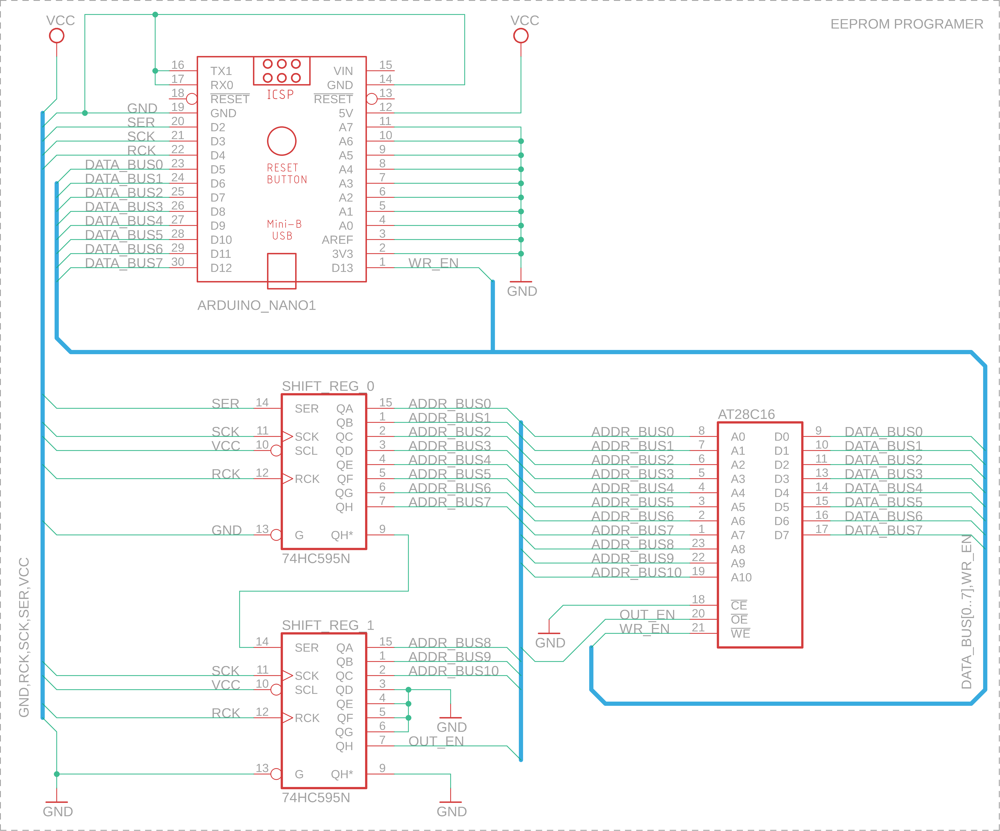

# EEPROM programer

## Overview
EEPROM programer dedicated for AT28C16 memory.
Electrical schema was created in [EAGLE](https://www.autodesk.com/products/eagle/overview):

<div>
    <p align="center" width="100%">
        
    </p>
    <p align="center">
        <i>Figure 1.1: EEPROM prog schema"</i>
    </p>
</div>

It was done based on Arduino Nano 3.0 (ATmega328P):

<div>
    <p align="center" width="100%">
        
    </p>
    <p align="center">
        <i>Figure 1.2: Possible implementation on prototype board"</i>
    </p>
</div>

Software library is written in C++, available in `code/eeprom`.
To use it copy `eeprom` folder into your sketch directory (to check directory from [Arduino IDE](https://www.arduino.cc/en/software):
go into: File --> Preferences --> Settings --> Sketchbook location), and load it (Sketch --> Include Library --> eeprom). It will add
"include <eeprom.h>" header file to your project.

## Usage
Available API:
- begin(): configure pins and serial output
- setAddress(unsigned int address, bool rw_bit): choose memory address to perform action over the pointed cell
- read(unsigned int address): read byte of data from memory address
- write(unsigned int address, byte data): write byte of data under memory address
- print(byte data_row_size, unsigned int data_total_size): print on serial output (COM) piece of memory content
- clean(): erase whole memory chip (write 0xFF)

Example:
```C
#include <eeprom.h>

EEPROM eeprom;

void setup() {
    // configure library
    eeprom.begin();
    // write byte (0x01) of data at address 0x00
    eeprom.write(0x00, 0x01);
    // print two rows of data (16 bytes per row, 32 bytes in total)
    eeprom.print(16, 32);
    // read single byte of data from address
    byte read_data = eeprom.read(0x00);
}

void loop() {
}
```
